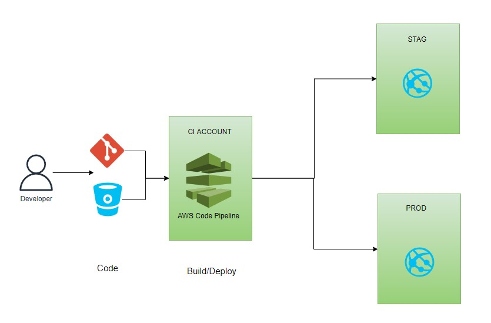
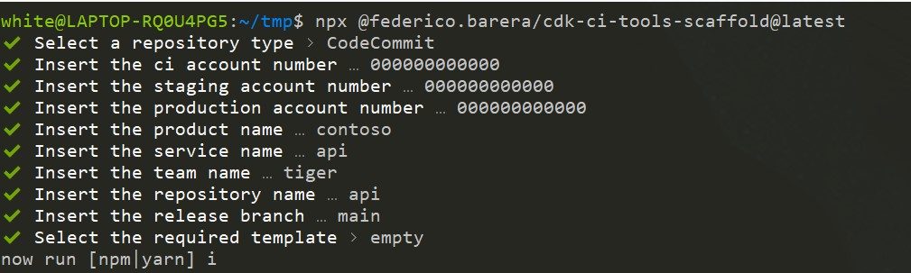

# CI Tools for CDK Applications

This repository contains constructs and scaffolders to create CI tools for `CDK Applications` and deploy them following best practices on accounts segregation and security.



# Boostrap

The `AWS CDK` needs to be installed first in the target accounts. This project also bootstraps extra resources referenced by the created pipelines that are going to help keep the accounts in a more maintanable stance. Follow first the boostrap process [here](./packages/cdk-boostrap/README.md)

# Usage

As of today, the scaffolder creates a CDK CI Pipeline within existing projects/repositories; It doesn't create the remote repository (in CodeCommit or Bitbucket) nor directly launches any cdk command to provision the pipeline in the AWS target environment. Future versions of the scaffolder will include the option to create the repository and automatically provision the pipeline.


<br />

---

```
mkdir tmp && cd tmp
npm init --yes
npx @federico.barera/cdk-ci-tools-scaffolder@latest
```

After the initial scaffold you can run either `npm|yarn` to pull the required packages and `npx cdk deploy --profile ci` to run the first synthetisation / deploy the pipeline.

## File Structure

```
project
│   cdk.json
│   checkov.yaml
│   tsconfig.infrastructure.json
│
└───infrastructure
    │
    └───bin
    │   |   build.sh
    │   |   create-pipeline.ts
    │   |   create-stack.ts
    │   |   integration-test.sh
    │   |   post-deployment.sh
    │   |   test.sh
    |
    └───lib
        |   pipeline-stack.ts
        |   service-stack.ts
```

| file                                   | description                                                                                                                                                                                                                                                                                                |
| -------------------------------------- | ---------------------------------------------------------------------------------------------------------------------------------------------------------------------------------------------------------------------------------------------------------------------------------------------------------- |
| cdk.json                               | Contains the entire configuration for the deployment. See below for more details                                                                                                                                                                                                                           |
| checkov.yaml                           | Contains the configuration for infrastructure validation. You can see more configuration info @ [checkov.io](https://www.checkov.io/). Checkov is ran as part of the pipeline to validate that the infrastructure generated is compliant                                                                   |
| tsconfig.infrastructure.json           | tsconfig for infrastructure typescript code. Modify as seen fit                                                                                                                                                                                                                                            |
| infrastructure/bin/build.sh            | The build file is the first extensibility point and is called by the pipeline to compile the cdk project. You can add any extra operation here before the cdk app is compiled                                                                                                                              |
| infrastructure/bin/integration-test.sh | This script is run by the pipeline after the application has been deployed in the staging environment. If an integration test role has been provisioned during bootstrap in the staging account, the test will assume its identity so that resources could be access/tested directly in the target account |
| infrastructure/bin/post-deployment.sh  | This script is run by the pipeline after the application has completed the deployment to production. By default it tags the repository with the release date. Script can be changed to accomodate any other post deployment operation                                                                      |
| infrastructure/bin/test.sh             | The script is run after the project has run the build.sh and compile phase. By default it calls the `npm run test` command and checkov validation.                                                                                                                                                         |
| infrastructure/bin/create-pipeline.ts  | This command is executed by default by the cdk application. Doesn't require any modification unless a competely different pipeline logic needs to be created.                                                                                                                                              |
| infrastructure/bin/create-stack.ts     | This command can be executed on request. It directly creates a dev stack in the staging account                                                                                                                                                                                                            |
| lib/pipeline-stack.ts                  | Called by `create-pipeline.ts` command. Mostly initialise the pipeline construct passing required configuration                                                                                                                                                                                            |
| lib/service-stack.ts                   | This stack is created by the pipeline in both staging and production. This file is intended to be modified with your cdk application components. See below for extra configuration                                                                                                                         |

## cdk.json

```json
{
  "app": "npx ts-node --project=tsconfig.infrastructure.json --prefer-ts-exts infrastructure/bin/create-pipeline.ts",
  "context": {
    "@aws-cdk/core:newStyleStackSynthesis": true,
    "accessLogBucket": {
      "exportName": "cdk-boostrap-access-logs"
    },
    "ci": {
      "account": "000000000000",
      "region": "eu-west-1",
      "intergrationTestsRoleArn": "arn:aws:iam::000000000000:role/cdk-bootstrap-itests-role",
      "crossRegionArtifactBuckets": {
        "eu-west-1": {
          "bucketArn": {
            "exportName": "cdk-bootstrap-artifacts-eu-west-1"
          },
          "keyArn": {
            "exportName": "cdk-bootstrap-artifacts-key-eu-west-1"
          }
        },
        "us-east-1": {
          "bucketArn": {
            "exportName": "cdk-bootstrap-artifacts-us-east-1"
          },
          "keyArn": {
            "exportName": "cdk-bootstrap-artifacts-key-us-east-1"
          }
        }
      },
      "logsGroupName": "cdk-bootstrap-codebuild-logs",
      "dockerSecretName": {
        "exportName": "cdk-bootstrap-dockerHub-secret"
      },
      "chatbotArn": {
        "exportName": "cdk-bootstrap-chatbot"
      },
      "codeStarConnection": {
        "exportName": "cdk-bootstrap-repos-connection"
      },
      "repositoryType": "codecommit"
    },
    "stag": {
      "account": "000000000000",
      "region": "eu-west-1"
    },
    "prod": {
      "account": "000000000000",
      "region": "eu-west-1"
    },
    "tags": {
      "product": "contoso",
      "repository": "api",
      "team": "tiger",
      "service": "api"
    },
    "branch": "main"
  }
}
```

All the configuration sections below marked as optional can be removed from the cdk.json file. The pipeline construct will tolerate missing configurations and apply defaults / skip functionalities

| section                    | type       | description                                                                                                                                                                                                                                                                                                                                           |
| -------------------------- | ---------- | ----------------------------------------------------------------------------------------------------------------------------------------------------------------------------------------------------------------------------------------------------------------------------------------------------------------------------------------------------- |
| ci/stag/prod               | required   | Environments. You can put extra configuration within the environment itself. It's going to overwrite any key available at a higher level (see service-stack.ts examples below for configuration retrieval)                                                                                                                                            |
| account / region           | required   | used by the CDK for deployment purpose                                                                                                                                                                                                                                                                                                                |
| accessLogBucket            | optional   | Unless explicitely modified. s3 buckets will point access logs to this bucket. The bucket is created as part of the boostrap process                                                                                                                                                                                                                  |
| intergrationTestsRoleArn   | optional   | The role assumed by the integration tests after staging deployment. The role is created as part of the boostrap                                                                                                                                                                                                                                       |
| crossRegionArtifactBuckets | optional   | Buckets and keys are used to centralized artifacts. See bootstrap process for more                                                                                                                                                                                                                                                                    |
| logsGroupName              | optional   | AWS CodeBuild logs are centralized in this bucket. The group is created as part of the boostrap                                                                                                                                                                                                                                                       |
| dockerSecretName           | optional   | This username/password tuple is used by the pipeline to authenticate with the dockerHub. The secret is created as part of the boostrap                                                                                                                                                                                                                |
| chatbotArn                 | optional   | This ARN points to the chatbot for pipeline notifications. The chatbot is created as part of the boostrap                                                                                                                                                                                                                                             |
| codeStarConnection         | optional\* | The connection used to authenticate with the external repository system (if the pipeline source is different from codecommit). The connection is created part of the boostrap process                                                                                                                                                                 |
| repositoryType             | required   | Currently supports `codecommit/bitbucket`. \* `codecommit` repositories must live in the same account/region where the pipelines are deployed. `bitbucket`, and any future external repository, require a codeStartConnection (either provisioned by the boostrap process or manually) to allow the pipeline to authenticate with the external system |
| tags                       | required   | Required tags must be kept. Any other tag can be added and will be assigned to all resources deployed                                                                                                                                                                                                                                                 |

## service-stack.ts

```ts
import { Construct } from "constructs";
import {
  BaseStack,
  BaseStackProps,
  ResourceLookup,
} from "@federico.barera/cdk-ci-tools-constructs";

export type ServiceStackProps = BaseStackProps;

export class ServiceStack extends BaseStack {
  constructor(scope: Construct, id: string, props: ServiceStackProps) {
    super(scope, id, props);

    //Tries to retrieve a configuration key. The lookup starts from the cdk.json context root,
    //and can be overwritten placing keys within the stag and prod sections.
    this.context.tryGet<string>("key");

    //Resolves a resource pointer. Either:
    //string (like arns and such)
    //{ exportName: '*' } (imports the value exported by another stack)
    this.resolveLookup(this.context.getOrThrow<ResourceLookup>("key"));
    this.resolveLookup("arn:..");
    this.resolveLookup({ exportName: "exportedResource" });

    //Creates a name with (tag.product - tag.service - ...ids - region - [branch(if not default branch)])
    //This funcion aims at creating unique names, however it's not bullet proof
    //CF already create unique names, it's reccommended to avoid naming resources unless strictly necessary
    this.name("abc", "def");
  }
}
```

`service-stack.ts` is to be modified with the application you intend to deploy to staging and production. Configuration is intended to be retrieved via the provided functions and can be set via cdk.js.

# Fork

TODO

# Contribute

TODO
