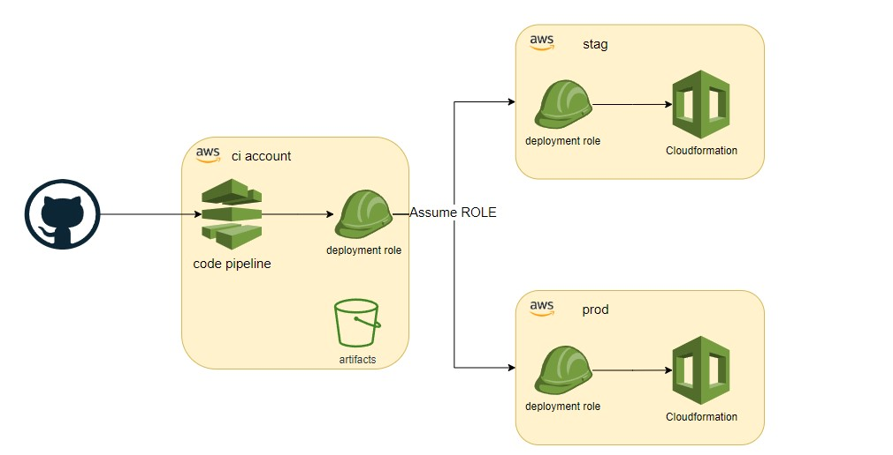
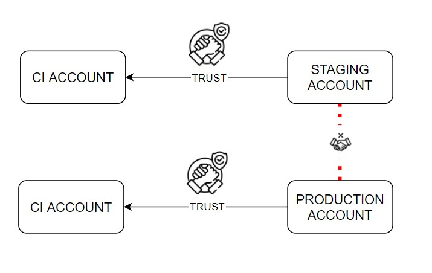

# Introduction

This repository contains a CDK Application that prepares 3 AWS accounts to deploy `CDK Applications` via `AWS CodePipelines`. The steps contained in this document follow best practices to separate CI Accounts from Production Accounts.

<br />


One difference introduced by this boostrap process is the creation of centralized artifacts buckets and keys. By default, CDK Pipelines create one support stack per pipeline/region, which tends to create lots of clutter/dead resources in the account, especially if you create dedicated pipelines per feature branches (which is unfortunately one limitation of current CodePipelines).

The application also scaffolds a set of resources (log buckets, secrets, etc) that are referenced by the `cdk-scaffold` to create efficient pipelines that do not create clutter and follow security best practices (see below for more information)

This setup has been inspired from [this article](https://kichik.com/2021/12/11/avoiding-cdk-pipelines-support-stacks/) and from daily support pain introduced by the default CDK Setup.

# CDK Bootstrap

This steps are intended to be run only once to install the CDK into your accounts. More info available [here](https://aws.amazon.com/blogs/developer/cdk-pipelines-continuous-delivery-for-aws-cdk-applications/)

<br />

<br /><br />

```
#stag

npx cdk bootstrap --profile stag --trust [ci_account] --cloudformation-execution-policies arn:aws:iam::aws:policy/AdministratorAccess aws://[stag_account]/eu-west-1
npx cdk bootstrap --profile stag --trust [ci_account] --cloudformation-execution-policies arn:aws:iam::aws:policy/AdministratorAccess aws://[stag_account]/us-east-1

#prod

npx cdk bootstrap --profile prod --trust [ci_account] --cloudformation-execution-policies arn:aws:iam::aws:policy/AdministratorAccess aws://[prod_account]/eu-west-1
npx cdk bootstrap --profile prod --trust [ci_account] --cloudformation-execution-policies arn:aws:iam::aws:policy/AdministratorAccess aws://[prod_account]/us-east-1

#ci

npx cdk bootstrap --profile ci --cloudformation-execution-policies arn:aws:iam::aws:policy/AdministratorAccess aws://[ci_account]/eu-west-1
npx cdk bootstrap --profile ci --cloudformation-execution-policies arn:aws:iam::aws:policy/AdministratorAccess aws://[ci_account]/us-east-1

```

# Configuration

As of today, `cdk-boostrap` is not compiled into an `npx` executable. You have to manually modify the configuration in the `cdk.json` file with your account numbers and extra info (below) for supporting resources. I aim to create an executable like `cdk-scaffold` to perform the first bootstrap programmatically

```

[account] //Your ci,stag,prod
|
--> [scaffoldRegions] the regions in the account you want to prepare
--> [trustedRoles] //the cdk account:role you want to trusts
-> account
-> role
```

> **Note**: You can decide to reduce the setup from 3 to 2 or 1 accounts only. <br/>eg. you can decide to run CI directly in the staging account (in that case, remove the stag account section) or run everything into a single account (in that case remove both stag/prod sections). <br/><br/>
> If deciding so, keep in mind that the `cdk-scaffold` executable prepares deployment configurations that leverage 3 accounts. Those configuration files will have to be slightly modified to run into a single account.

<br />

## Slack ChatBot

Via configuration, you can crate a slack chatbot for your pipelines to send notifications to. Before being able to create one you need to manually create trust between the AWS Account and your slack workspace. To do so, navigate to `AWS Chatbot` in AWS console and click `Configure Client`. Authorize the OAUTH prompt. After that you should be able to see your Slack workspace name. Take note of the `Workspace ID`.

| Param            | Descriptions                                            |
| ---------------- | ------------------------------------------------------- |
| slackWorkspaceId | The workspace id as described above                     |
| slackChannelId   | The id of the channel you want to send notifications to |

## CodeStar Connection

A codestar connection is a trust established between the AWS account and a third party repository system, like GitHub or BitBucket. The connection can be used in codepipelines to get notified of changes (webhooks) and to pull the code. To create the connection, set the provider name and the connection name. The stack only creates the connection into a `Pending` state and the arn of the connection is exported via the stack. To finalize the connection, as a one off, an administrator needs to navigate via the console to Connections and complete the OAuth trust between the two systems

| Param    | Descriptions        |
| -------- | ------------------- |
| provider | Github/Bitbucket    |
| name     | The connection name |

## Execution

`npx cdk deploy --context target=[account] --profile [profile] "*"`

| Name    | Description                                                                                              |
| ------- | -------------------------------------------------------------------------------------------------------- |
| account | The account number you want to prepare. It must match the [account] in the cdk.json                      |
| profile | The named profile that contains the credentials to run cdk apps \*not required if credentials in context |

# Outputs

The app produces 2 stacks per account/region combination.
1 Stack contains the resource for that specific region plus the outputs to access those resources (`cdk-boostrap-support-[region]`).
1 Stack contains the named exports from the other stacks deployed in the same and other region (`cdk-boostrap-support`)

The second stack is used from code pipelines to points to artifact buckets and keys deployed in other region. (required for cross account deployments)
